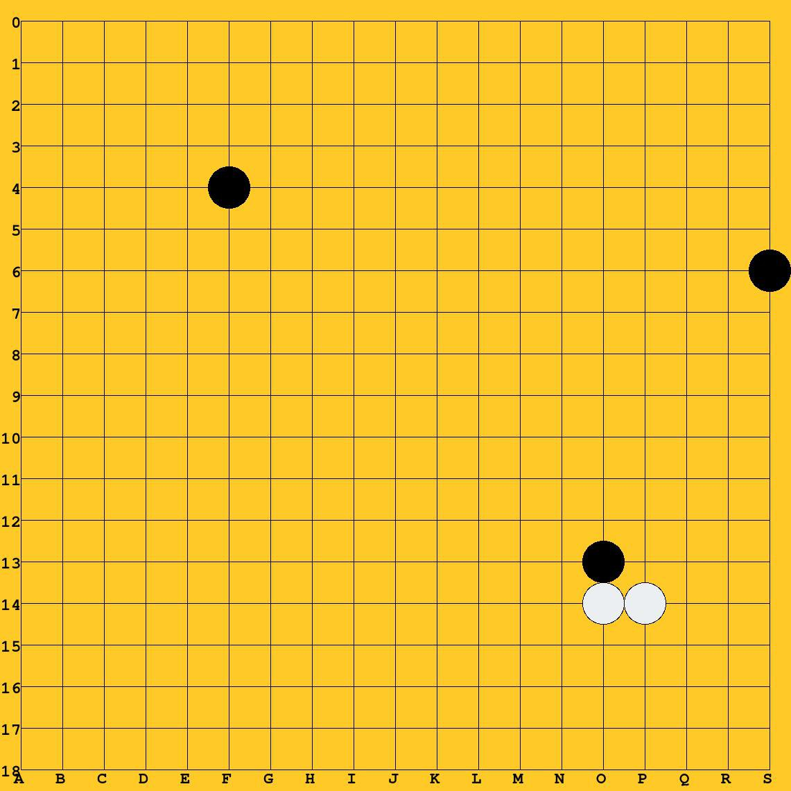

## goBot

A sketch for an telegram bot server to play go in a group chat.
To any game command the server replies with a generated PIL image of a go board

Exposes till now the following commands:

* **/start** register the chat at the server
* **/newgame** start a new Game for the chat (reset any running game)
* **/turn XY** make your turn at board position XY (ie e14)

Planned commands:

* **/back** undo the last turn
* **/finishgame** makes groups killable
* **/deadgroup XY** kills the group at XY (ie 14)
* **/export gameID FORMAT** export a played game in some formats

## Database

At the serverside a sqlite database addressed by sqlalchemy is used

The bot respondes with board images to your game commands:

